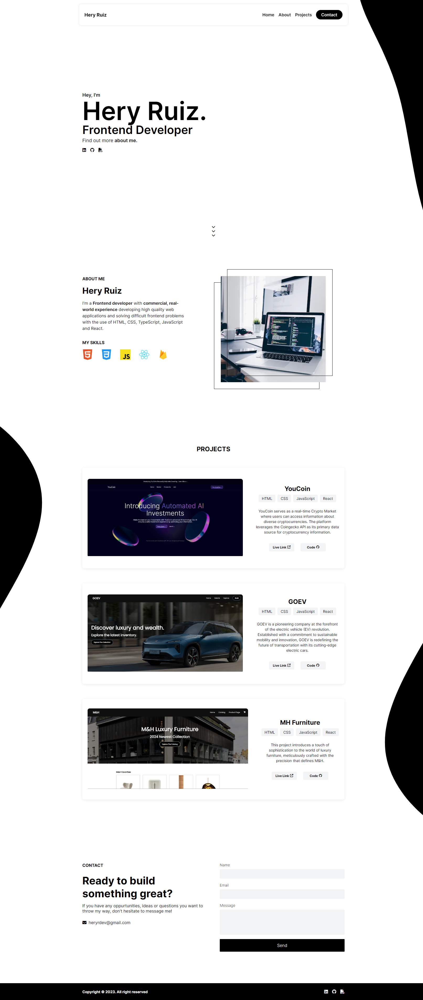

<h1 align='center'>Portfolio</h1>

Showcasing my diverse skill set with real world projects, my portfolio serves as a collection that traces my coding journey. Through insightful projects, it offers a comprehensive overview of my capabilities, illustrating my commitment to innovation. Check it out to see not just my tech skills but also my passion for making things look awesome and work well.

👉 Live Demo: <a href='https://heryruiz.com'>HeryRuiz.com</a>

<h3>Built using:</h3>

» JS  
» CSS  
» HTML 

 

<h2>Portfolio Screenshots</h2>
 
<h3 align='center'>Home Page 🏠</h3>

  

