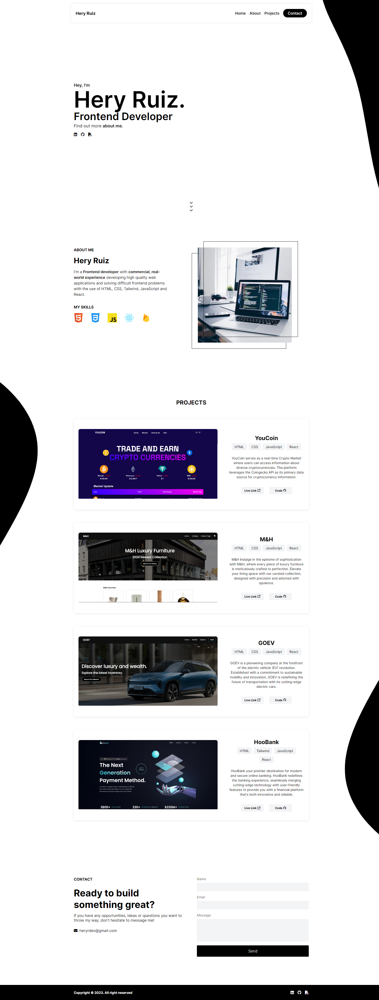

<h1 align='center'>Portfolio</h1>

Showcasing my diverse skill set, my portfolio serves as a collection that goes through my coding journey. Through a harmonious blend of design elements, insightful project narratives, and tangible outcomes, it provides a comprehensive overview of my capabilities, illustrating my commitment to innovation and excellence in every undertaking. Explore a compilation that not only reflects my technical proficiency but also communicates my passion for creating impactful and visually compelling solutions.

👉 Live Demo: <a href='https://heryruiz.com'>HeryRuiz.com</a>

<h3>Built using:</h3>

» JS  
» CSS  
» HTML 

 

<h2>Portfolio Screenshots</h2>
 
<h3 align='center'>Home Page 🏠</h3>

  

